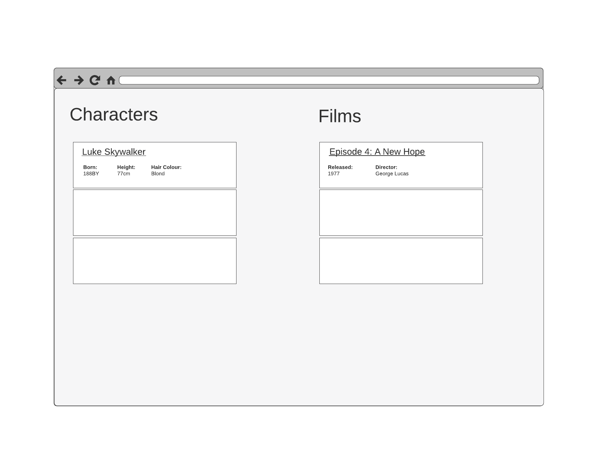

# Front End Developer - React Test (April 2020 Edition)

The goal of this test is to allow candidates to demonstrate their abilities
while interviewing with X2X.

The following exercise will be performed during the final interview stage with a
time box set at 1 hour. The goal of this is not to be perfect or even to
finish the exercise, but really for the interviewers to get a sense of how you
work.

## The Exercise

You will be building a simple list application using information about the Star
Wars film franchise:

The data for this test is available in the `src/api/` folder.

Instructions:

1. When the application loads, I should see a list of Star Wars characters
   appear on the left-hand side of the screen; this should display key
   information about the character
2. When I click on the name of a character, I should see their film appearances
   listed on the right-hand side; this should display key information about the
   film
3. When clicking on the name of a character, the films display should be cleared
   and some loading feedback should be shown

The outcome application should look approximate to the wireframe; styling
choices can be applied as to the developers taste.

You are free to add any dependencies or use any additional frameworks (like
Bootstrap) as you so wish. You are free to structure your code as you want and
there are no specific conventions you are required to follow. The use of React Hooks is ecouraged, but you will ultimately solve
this the way you want to solve it.

The interviewer(s) may ask some follow-up questions on completion of the exercise
and can be asked questions during the test.

## The Environment

For speed, this project was bootstrapped with [Create React App](https://github.com/facebook/create-react-app).

In the project directory, you can run:

### `npm start`

Runs the app in the development mode. 
Open [http://localhost:3000](http://localhost:3000) to view it in the browser.

The page will reload if you make edits. 
You will also see any lint errors in the console.

### `npm test`

Launches the test runner in the interactive watch mode. 
See the section about [running tests](https://facebook.github.io/create-react-app/docs/running-tests) for more information.
